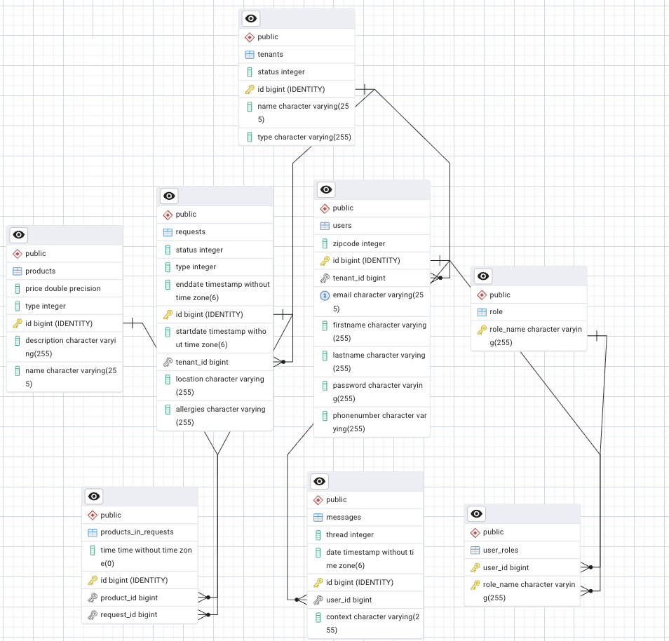

# Morgendagens

A multi-tenant request management platform built with Java and Javalin. Morgendagens lets tenants manage service requests, product catalogs, user accounts, and internal messaging — with built-in weather integration, JWT authentication, and role-based access control.

---

## Table of Contents

- [Features](#features)
- [Tech Stack](#tech-stack)
- [Project Structure](#project-structure)
- [Getting Started](#getting-started)
  - [Prerequisites](#prerequisites)
  - [Local Development](#local-development)
  - [Docker](#docker)
- [Configuration](#configuration)
- [API Reference](#api-reference)
  - [Authentication](#authentication)
  - [Tenants](#tenants)
  - [Users](#users)
  - [Products](#products)
  - [Requests](#requests)
  - [Products in Requests](#products-in-requests)
  - [Messages](#messages)
- [Authentication & Security](#authentication--security)
- [Database Schema](#database-schema)
- [Testing](#testing)
- [User Stories](#user-stories)

---

## Features

- **Multi-tenancy** — Users are isolated within tenants; each registration auto-creates a tenant
- **Request management** — Full lifecycle management of service requests with time slots, locations, allergies, and product line items
- **Product catalog** — Admins manage a shared product catalog with pricing and categorization
- **Weather integration** — Requests are enriched with hourly and daily weather forecasts for their location
- **Messaging** — Threaded in-platform messaging between users
- **JWT authentication** — Stateless token-based auth with configurable expiration
- **Role-based access control** — `USER` and `ADMIN` roles with per-route enforcement
- **Containerized** — Docker-ready with Amazon Corretto 17 Alpine base image

---

## Tech Stack

| Layer | Technology |
|---|---|
| Language | Java 17 |
| Web Framework | Javalin 7.0.1 |
| ORM | Jakarta Persistence / Hibernate 7.2.3 |
| Database | PostgreSQL |
| Authentication | Nimbus JOSE + JWT 10.7 (HS256) |
| Password Hashing | BCrypt (jbcrypt 0.4) |
| JSON | Jackson 2.17.2 |
| Templating | Thymeleaf 3.1.3 |
| Boilerplate Reduction | Lombok 1.18.42 |
| Logging | SLF4J + Logback |
| Testing | JUnit 5, TestContainers, REST Assured |
| Build | Maven (Shade plugin for fat JAR) |
| Container | Docker (Amazon Corretto 17 Alpine) |

---

## Project Structure

```
src/main/java/app/
├── Main.java                        # Entry point
├── App.java                         # App initialization
├── config/
│   ├── ApplicationConfig.java       # Javalin fluent builder
│   ├── EntityRegistry.java          # Hibernate entity registration
│   ├── HibernateConfig.java         # EMF singleton (dev + prod)
│   └── HibernateEmfBuilder.java     # EntityManagerFactory factory
├── entities/                        # JPA entities
│   ├── User.java
│   ├── Tenant.java
│   ├── Request.java
│   ├── Product.java
│   ├── ProductInRequest.java        # Request line items
│   ├── Message.java
│   └── Role.java
├── dto/                             # Data Transfer Objects
│   ├── UserDTO.java
│   ├── RequestDTO.java
│   ├── ProductDTO.java
│   ├── WeatherDTO.java
│   └── ...
├── services/
│   ├── routeSecurity/
│   │   ├── SecurityController.java  # Auth endpoint handlers
│   │   ├── TokenSecurity.java       # JWT creation & validation
│   │   ├── WeatherService.java      # External weather API client
│   │   └── routes/                  # Route definitions per entity
│   ├── entityServices/              # Business logic per entity
│   └── dtoConverter/               # DTO <-> Entity mappers
├── dao/                             # Data access layer
└── utils/                           # Utilities & seed data
```

---

## Getting Started

### Prerequisites

- Java 17+
- Maven 3.8+
- PostgreSQL (or Docker for containerized setup)

### Local Development

**1. Clone the repository:**
```bash
git clone <repo-url>
cd morgendagens
```

**2. Create a PostgreSQL database:**
```sql
CREATE DATABASE morgendagens;
```

**3. Configure your local properties:**

Create or edit `src/main/resources/config.properties`:
```properties
DB_NAME=morgendagens
DB_USERNAME=username
DB_PASSWORD=password
ISSUER=morgendagens
TOKEN_EXPIRE_TIME=3600000
SECRET_KEY=morgendagens-very-secret-key-256bit!!
```

**4. Build and run:**
```bash
mvn clean package
java -jar target/app.jar
```

The server starts at `http://localhost:7030/api`.

Hibernate will automatically create and update the database schema on startup.

### Docker

**Build the image:**
```bash
docker build -t morgendagens:latest .
```

**Run the container:**
```bash
docker run -p 7030:7030 \
  -e DEPLOYED=true \
  -e CONNECTION_STR=jdbc:postgresql://host.docker.internal:5432/ \
  -e DB_NAME=morgendagens \
  -e DB_USERNAME=username \
  -e DB_PASSWORD=password \
  -e ISSUER=morgendagens \
  -e TOKEN_EXPIRE_TIME=3600000 \
  -e SECRET_KEY=your-secret-key-at-least-32-bytes!! \
  morgendagens:latest
```

---

## Configuration

The application switches between development and production mode based on the presence of a `DEPLOYED` environment variable.

| Variable | Description | Dev default |
|---|---|---|
| `DB_NAME` | Database name | `morgendagens` |
| `DB_USERNAME` | Database user | `postgres` |
| `DB_PASSWORD` | Database password | `postgres` |
| `CONNECTION_STR` | JDBC URL prefix (production only) | — |
| `DEPLOYED` | Enables container/server configuration | — |
| `PORT` | HTTP port used by the app | `7030` |
| `ISSUER` | JWT issuer claim | `morgendagens` |
| `TOKEN_EXPIRE_TIME` | Token TTL in milliseconds | `3600000` (1 hour) |
| `SECRET_KEY` | HS256 signing secret (32+ bytes) | `morgendagens-very-secret-key-256bit!!` |

In production, set the `DEPLOYED` environment variable to any value and supply all of the above as environment variables.

---

## API Reference

All endpoints are prefixed with `/api`. Protected endpoints require an `Authorization: Bearer <token>` header.

### Health

| Method | Path | Access | Description |
|---|---|---|---|
| `GET` | `/api/health` | Public | Container health check endpoint |

### Authentication

| Method | Path | Access | Description |
|---|---|---|---|
| `POST` | `/api/auth/register` | Public | Register a new user (auto-creates a tenant) |
| `POST` | `/api/auth/login` | Public | Login and receive a JWT |
| `GET` | `/api/auth/protected` | USER | Example protected endpoint |

**Register body:**
```json
{
  "email": "user@example.com",
  "password": "secret123"
}
```

**Register response:**
```json
{
  "tenantID": 1,
  "id": 1,
  "msg": "User created successfully"
}
```

**Login body:**
```json
{
  "email": "user@example.com",
  "password": "secret123"
}
```

**Login response:**
```json
{
  "token": "<jwt>",
  "username": "user@example.com",
  "id": 1,
  "role": "USER",
  "accepted": true
}
```

---

### Tenants

| Method | Path | Access | Description |
|---|---|---|---|
| `GET` | `/api/tenant/all` | USER, ADMIN | Get all tenants |
| `GET` | `/api/tenant/{id}` | USER, ADMIN | Get tenant by ID |
| `POST` | `/api/tenant/` | ADMIN | Create a tenant |
| `PUT` | `/api/tenant/{id}` | ADMIN | Update a tenant |
| `DELETE` | `/api/tenant/{id}` | ADMIN | Delete a tenant |

---

### Users

| Method | Path | Access | Description |
|---|---|---|---|
| `GET` | `/api/user/all` | ADMIN | Get all users |
| `GET` | `/api/user/{id}` | ADMIN | Get user by ID |
| `POST` | `/api/user/` | ADMIN | Create a user |
| `PUT` | `/api/user/{id}` | ADMIN | Update a user |
| `DELETE` | `/api/user/{id}` | ADMIN | Delete a user |

---

### Products

| Method | Path | Access | Description |
|---|---|---|---|
| `GET` | `/api/product/all` | USER, ADMIN | Get all products |
| `GET` | `/api/product/{id}` | USER, ADMIN | Get product by ID |
| `POST` | `/api/product/` | ADMIN | Create a product |
| `PUT` | `/api/product/{id}` | ADMIN | Update a product |
| `DELETE` | `/api/product/{id}` | ADMIN | Delete a product |

---

### Requests

| Method | Path | Access | Description |
|---|---|---|---|
| `GET` | `/api/request/all` | USER, ADMIN | Get all requests |
| `GET` | `/api/request/{id}` | USER, ADMIN | Get request by ID |
| `GET` | `/api/request/user/{userId}` | USER, ADMIN | Get requests for a user's tenant |
| `POST` | `/api/request/` | USER, ADMIN | Create a request |
| `PUT` | `/api/request/{id}` | USER, ADMIN | Update a request |
| `DELETE` | `/api/request/{id}` | ADMIN | Delete a request |

Requests include weather forecast data for the request location.

---

### Products in Requests

| Method | Path | Access | Description |
|---|---|---|---|
| `GET` | `/api/product-in-requests/all` | USER, ADMIN | Get all line items |
| `GET` | `/api/product-in-requests/{id}` | USER, ADMIN | Get line item by ID |
| `POST` | `/api/product-in-requests/` | USER, ADMIN | Add product to request |
| `PUT` | `/api/product-in-requests/{id}` | USER, ADMIN | Update line item |
| `DELETE` | `/api/product-in-requests/{id}` | USER, ADMIN | Remove product from request |

---

### Messages

| Method | Path | Access | Description |
|---|---|---|---|
| `GET` | `/api/message/all` | USER, ADMIN | Get all messages |
| `GET` | `/api/message/{id}` | USER, ADMIN | Get message by ID |
| `POST` | `/api/message/` | USER, ADMIN | Send a message |
| `PUT` | `/api/message/{id}` | USER, ADMIN | Update a message |
| `DELETE` | `/api/message/{id}` | USER, ADMIN | Delete a message |

---

## Authentication & Security

**Registration & Login flow:**

1. `POST /api/auth/register` — hashes the password with BCrypt (12 rounds), creates a tenant and user, assigns the `USER` role, returns user and tenant IDs.
2. `POST /api/auth/login` — verifies the BCrypt hash, issues a signed JWT containing `email`, `roles`, `issuer`, and expiration.
3. All subsequent requests include `Authorization: Bearer <token>` — the token is validated on every protected route.

**JWT details:**
- Algorithm: HS256 (HMAC SHA-256)
- Claims: `sub`, `iss`, `email`, `roles`, `expirationTime`
- Default TTL: 1 hour (configurable via `TOKEN_EXPIRE_TIME`)

**Role model:**

| Role | Capabilities |
|---|---|
| `USER` | Read products, tenants; create and update own requests and messages |
| `ADMIN` | Full CRUD across all resources |

---

## Database Schema

```
users           → belongs to one tenant, has many messages, has many roles (M2M)
tenants         → has many users, has many requests
requests        → belongs to one tenant, has many products_in_requests (cascade delete)
products        → has many products_in_requests (cascade delete)
products_in_requests → links request + product with a scheduled time
messages        → belongs to one user, has a thread ID and timestamp
role            → USER | ADMIN
user_roles      → M2M junction: users ↔ roles
```

Hibernate manages schema creation and updates automatically (`hbm2ddl.auto=update` in development).

## ENTITY RELATIONAL DIAGRAM



---

## Testing

Integration tests use **TestContainers** to spin up a real PostgreSQL database, ensuring tests run against the actual database engine.

```bash
mvn test
```

Test coverage includes:
- Authentication (registration, login, token validation)
- Role-based authorization (USER vs ADMIN access)
- Full CRUD for all entities
- Tenant isolation

Tests use **REST Assured** for HTTP-level assertions against a live Javalin server wired to the TestContainers database.

---

## User Stories

### 1. Requests (Catering & Cleaning)

- As a customer I want to be able to select **"catering"** or **"cleaning"** as the request type, so the correct fields and products are shown.
- A request must as a minimum contain: date, time, product name, address, contact information, and number of guests/persons (depending on type).
- The system must validate date/time (no requests in the past) and display clear error messages.
- As a customer I want to be able to add **comments, allergens, and special wishes** to a request.
- As a customer I want to be able to **upload files** (e.g. floor plan, allergen list, photos of location) to a request.
- The system must assign a request a **status flow**: New → In Progress → Offer Sent → Accepted → Rejected → Order → Completed / Cancelled.
- As an admin I want to be able to **assign a request to an employee** (responsible person) so tasks are distributed.

---

### 2. Products, Packages & Pricing Logic

- As an admin I want to be able to set **minimum quantities, delivery surcharges, weekend surcharges, and discount codes**.
- The system must save price lines as a **"snapshot"** so that an old order does not change price if product prices are updated later.
- As an admin I want to be able to mark products as **"seasonal / out of stock"** so they cannot be selected.

---

### 3. Offers, Acceptance & Conversion to Order

- As a customer I want to be able to **receive an offer by email** and accept or reject it via a link (optionally with an expiry date on the offer).
- The system must **log all offers and rejections** (who, when, comment).
- As an admin I want to be able to **send an offer with a PDF** (item list, price, terms) and see the "offer sent" timestamp.
- When a request becomes an order: the system must **lock relevant fields** (or create an "order copy") to maintain a reliable history.

---

### 4. Customer Portal (My Orders)

- As a customer I want to be able to **log in and view status, price, details, and history** of my requests and orders.
- As a customer I want to be able to **download invoice / offer / order confirmation as PDF**.
- As a customer I want to be able to **send messages to admin on an order** (message thread) so all dialogue is gathered in one place.

---

### 5. Admin Overview, Tables & Pop View

- As an admin I want to be able to **filter and sort tables** (date, type, status, customer, responsible person).
- As an admin I want to be able to **search across customers, requests, and orders** (name, phone, email, order number).
- The pop view must show: contact info, address, schedule, products, notes, allergens, status, history, and mail log.
- As an admin I want to be able to **export data to CSV/Excel** (orders in a period, top customers).

---

### 6. Calendar & Planning

- The admin calendar must support **day / week / month views** with colour codes for catering / cleaning / status.
- As an admin I want to be able to **see conflicts** (time overlaps, capacity limits, delivery zones).
- As an admin I want to be able to **drag an order to a new time slot** in the calendar (drag & drop) or delete it with an automatic customer email about the change.
- The system must be able to **sync to an external calendar** (Google / Outlook) or at minimum generate an iCal invite.

---

### 7. Notifications & Mail Flow

The system must send:
- **Confirmation on request** (to customer)
- **"New request" notification** (to admin)
- **Offer / rejection** (to customer)
- **Order confirmation** (to customer)
- **Change notification on update** (to customer and admin)

Additional requirements:
- The system must save a **mail log per request/order** (sent, timestamp, content/template).
- As an admin I want to be able to **configure mail templates** (text, logo, contact info, terms).

---

### 8. Business Customer Portal (Company Portal)

- The company portal must **require login and only show that company's own requests/orders** (role-based access).
- As a business customer I want to be able to **create, edit, and delete requests with live updates for admin** (and a log of changes).
- As an admin I want to be able to **define what business customers are allowed to change** (e.g. time slot and quantity, but not prices).
- As a business customer I want to be able to create **templates** (e.g. recurring Tuesday lunch) for quick request creation.
- As a business customer I want to be able to **search and filter all orders** (period, status, location).
- The system must have an **audit trail**: who changed what and when (critical when customers can edit).

---

### 9. Cleaning as a Separate Flow

- Cleaning requests must be able to contain: **location, m² / room types, desired duration, frequency** (one-time / weekly), materials.
- As an admin I want to be able to **assign cleaning tasks to specific teams** and view routes / zones.
- The system must be able to **generate a checklist per cleaning order** (task types).

---

### 10. Non-Functional Requirements

- The system must be **mobile-friendly** — the customer flow must work on phones.
- The system must comply with **GDPR**: consent, data processing agreement, option for deletion / anonymisation, logging of consent.
- The system must be **secure**: role-based access control (customer / business / admin), rate limiting on forms, 2FA for admin (nice-to-have).
- The system must meet **performance requirements** (e.g. "admin table must load in <2 seconds with 5,000 orders").
- The system must support **backup and restore**.
